# Sitio Web para la clase de integrador 

Sitio web creado utilizando MVC, PHP Y MYSQL.


## Como Usarlo

Para la realización del proyecto utilizamos la herramienta laragon, en los archivos de este repositorio podras encontrar la base de datos, lo unico que debes hacer es importar la misma desde el panel de phpmyadmin. 

```bash
  1. abre laragon
  2. Iniciar Todo
  3. Clic derecho, entrar a las opciones de mysql y abre phpmyadmin e importa la base de datos.
  4. La base de datos cuenta con un usuario administrador con el cual podremos empezar a realizar las pruebas:
  usuario: cristian@admin.com
  contraseña: admin
```


una vez realizado esto lo unico que debes hacer es copiar la estructura del proyecto dentro de tu carpeta www la cual se encuentra en los archivos de laragon. 

## Screenshots de la app


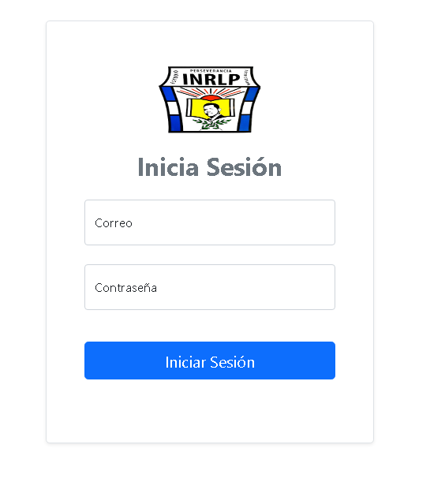

## VISTA ADMINISTRADOR CARACTERISTICAS
panel principal
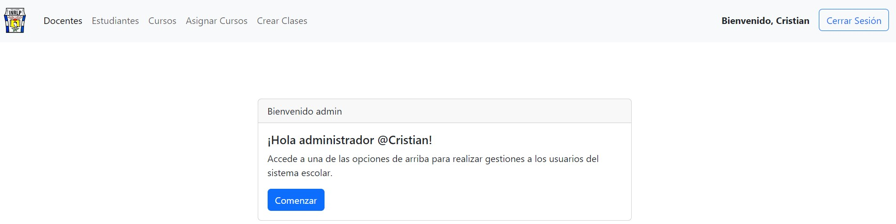

## CREAR DOCENTE 
nos permite insertar la información de un docente al sistema.
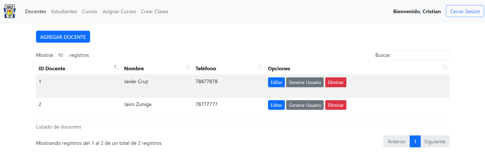

## CREAR ESTUDIANTE 
Nos permite ingresar la información de un estudiante al sistema.
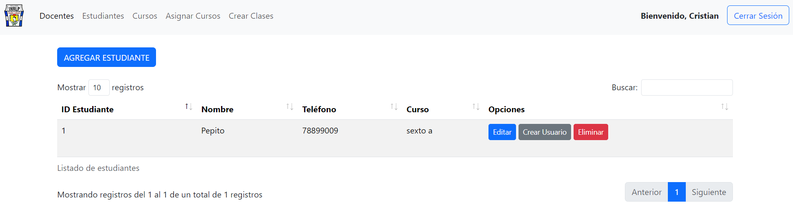

## CREAR CURSO 
Este apartado permite crear a los grados, secciones o cursos. 
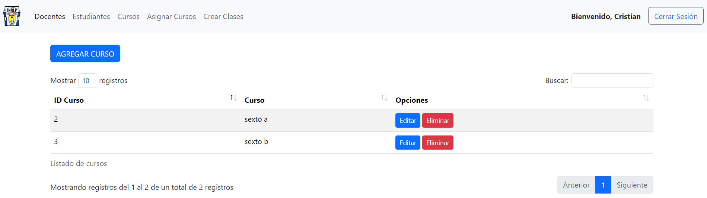

## ASIGNAR CURSO
Este apartado permite asignar un docente guía a la sección o curso.  
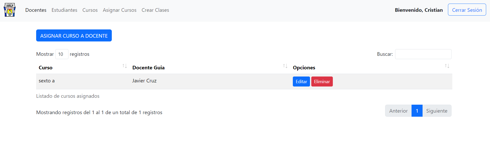

## CREAR CLASE  
Permite ingresar las clases que se llevan en la escuela. 
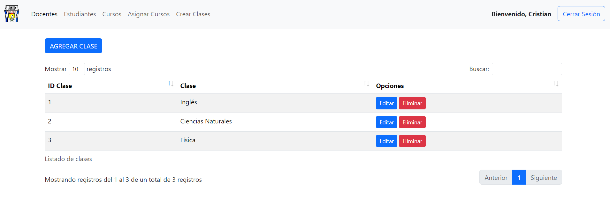

## CREACIÓN DE USUARIOS 
### tanto el apartado de docentes como el apartado de estudiantes cuentan con una opción que les permite generar un usuario, con el mismo, ellos podrán acceder al sistema. 
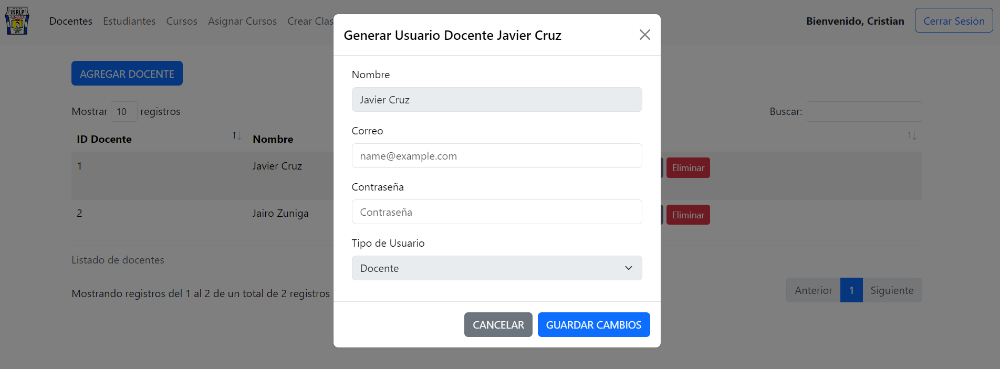

## OTROS PERFILES 
### PERFIL DOCENTE
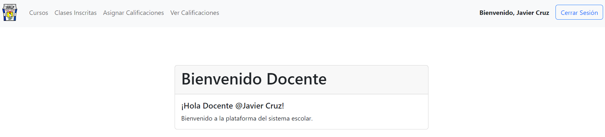

### CARACTERISTICAS
Asignar Clases al curso, el docente puede agregar las clases que llevarán sus estudiantes guíados.


### LISTADO DE CLASES INSCRITAS 
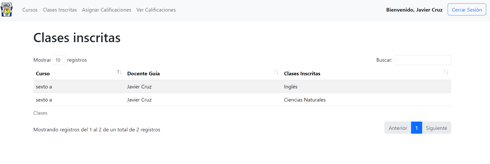

### ASIGNAR CALIFICACIONES
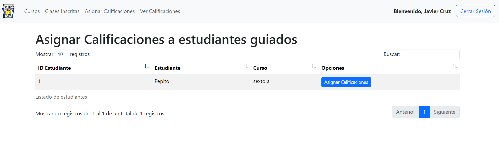

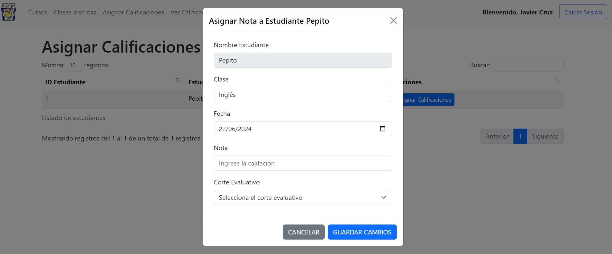

Posterior podemos acceder al control de calificaciones donde observamos todas las que han sido asignadas.

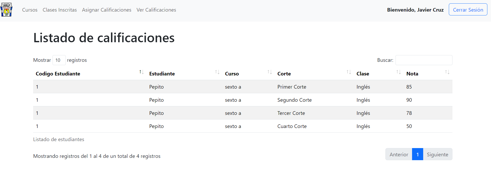

## PERFIL ESTUDIANTE CARACTERISTICAS 
### Los estudiantes pueden acceder al sistema a través de su usuario y contraseña y tienen acceso a los siguientes apartados: 

Visualizar Clases inscritas 
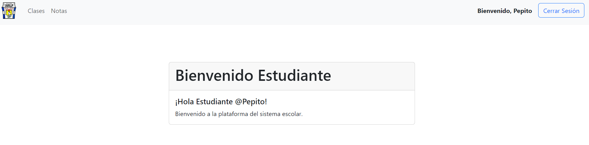

Ver Notas y Promedio, para esto utilizamos la metodologia de evaluacion del MINED 4 cortes y una nota final. 

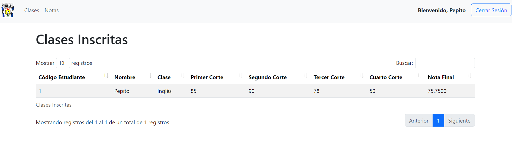
